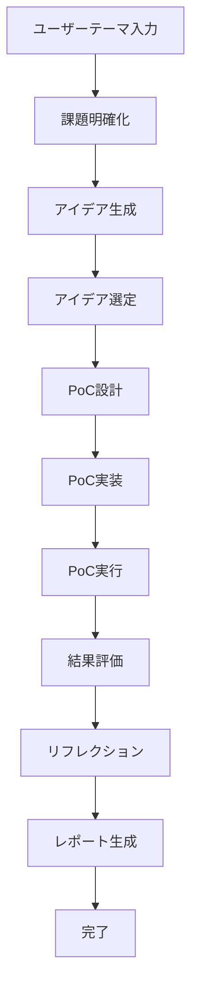

# AI-PoC-Agents-v2

AI-PoC-Agents-v2は、ユーザーが与えたテーマについて自動的にProof of Concept (PoC)を実施するマルチエージェントフレームワークです。

## 概要

3つの専門エージェントが協調して、曖昧なアイデアから実用的なPoCまでを自動的に実現します：

1. **課題明確化・アイデア生成エージェント**: 問題を分析し、複数の解決策を提案
2. **PoC設計・実施エージェント**: 技術設計から実装・実行まで
3. **結果評価・リフレクションエージェント**: 結果分析と改善提案

## 特徴

- ✅ **自動化されたPoC開発**: アイデアから実装まで全自動
- ✅ **多段階評価**: 技術・ビジネス・イノベーションの多角的評価
- ✅ **包括的レポート**: エグゼクティブサマリーから技術詳細まで
- ✅ **再現可能な実行環境**: Dockerベースの環境構築
- ✅ **リアルタイム進捗**: ストリーミング実行による進捗監視

## クイックスタート

### インストール

```bash
# リポジトリのクローン
git clone <repository-url>
cd AI-PoC-Agents-v2

# 依存関係のインストール
uv sync

# 環境変数の設定
export OPENAI_API_KEY="your-api-key-here"
```

### 基本的な使い方

```bash
# OCRの例
uv run python main.py --theme "画像内の日本語テキストを自動で読み取るOCRを作りたい" --description "ひらがな、カタカナ、漢字、縦書き・横書きの両方に対応する日本語文字認識システム" --domain "AI/機械学習"

# リアルタイム実行
uv run python main.py --theme "チャットボットを作りたい" --stream

# 設定ファイル使用
uv run python main.py --theme "Webアプリを作りたい" --config configs/default_config.yaml
```

### 主なオプション

- `--theme`: PoC のテーマ（必須）
- `--description`: 詳細な説明
- `--domain`: ドメイン/業界コンテキスト
- `--workspace`: 作業ディレクトリ（デフォルト: ./workspace）
- `--stream`: リアルタイム実行
- `--max-iterations`: フェーズごとの最大反復回数（デフォルト: 3）
- `--score-threshold`: 次フェーズへ進む最小スコア（デフォルト: 0.7）

## プロジェクト構造

```
AI-PoC-Agents-v2/
├── src/ai_poc_agents_v2/
│   ├── core/           # コア機能（状態管理、設定）
│   ├── agents/         # 3つの専門エージェント
│   ├── workflow/       # ワークフロー制御
│   └── tools/          # ユーティリティツール
├── configs/            # 設定ファイル
├── examples/           # 使用例
├── tests/              # テストコード
└── workspace/          # 生成されるアーティファクト
```

## ワークフロー



## 出力例

実行後、以下のアーティファクトが生成されます：

```
workspace/
├── problem_identification/
│   └── problem_analysis.json
├── idea_generation/
│   └── generated_ideas.json  
├── poc_design/
│   ├── design_document.md
│   └── architecture.json
├── poc_implementation/
│   ├── code/
│   │   ├── main.py
│   │   ├── requirements.txt
│   │   └── README.md
│   └── execution_plan.md
├── result_evaluation/
│   └── evaluation_report.md
├── reflection/
│   └── reflection_analysis.md
├── reporting/
│   ├── final_report.md
│   ├── executive_summary.md
│   └── poc_summary.json
└── final_state.json
```

## 設定

`configs/default_config.yaml`で各種設定をカスタマイズ：

```yaml
model:
  api_key: ""
  temperature: 0.1
  problem_identifier: "gpt-4o"
  poc_implementer: "gpt-4o"
  # ...

workflow:
  max_iterations: 3
  score_threshold: 0.7
  timeout_minutes: 30
  # ...
```

## 開発

### テスト実行

```bash
# 構造テスト
uv run python test_ocr_example.py

# ユニットテスト
uv run pytest tests/

# カバレッジ
uv run pytest --cov=ai_poc_agents_v2
```

### コード品質

```bash
# フォーマット
uv run black src/ tests/

# リント
uv run flake8 src/ tests/

# 型チェック
uv run mypy src/
```

## API リファレンス

### PoCProject

```python
from ai_poc_agents_v2 import PoCProject

project = PoCProject(
    theme="テーマ",
    description="説明", 
    domain="ドメイン",
    timeline_days=7
)
```

### PoCWorkflow

```python
from ai_poc_agents_v2 import PoCWorkflow, Config

config = Config()
workflow = PoCWorkflow(config)
result = workflow.run(initial_state)
```

## 制限事項

- OpenAI API キーが必要
- 実行時間はテーマの複雑さに依存（通常5-30分）
- 生成されるコードは PoC レベル（本番運用には追加作業が必要）

## ライセンス

MIT License

## 貢献

Issues や Pull Requests をお待ちしています。

## サポート

- [GitHub Issues](https://github.com/ai-poc-agents/ai-poc-agents-v2/issues)
- [ドキュメント](https://docs.ai-poc-agents.com)