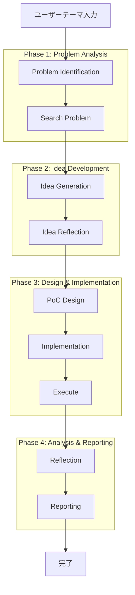

# AI-PoC-Agents-v2

AI-PoC-Agents-v2は、ユーザーが与えたテーマについて自動的にProof of Concept (PoC)を実施するマルチエージェントフレームワークです。

## 概要

9つの専門エージェントが協調して、曖昧なアイデアから実用的なPoCまでを自動的に実現します：

### Phase 1: Problem Analysis
1. **Problem Identification Agent**: 問題特定・分析・タスク分類
2. **Search Problem Agent**: 問題領域調査（Qiita + ローカルコード検索）

### Phase 2: Idea Development
3. **Idea Generation Agent**: アイデア生成
4. **Idea Reflection Agent**: アイデア評価・実装可能性判断

### Phase 3: Design & Implementation
5. **PoC Design Agent**: 技術分析・要件定義・アーキテクチャ設計
6. **Implementation Agent**: コード実装（サンプルコード活用）
7. **Execute Agent**: コード実行・評価

### Phase 4: Analysis & Reporting
8. **Reflection Agent**: 全体分析・改善提案
9. **Reporting Agent**: 文書化・レポート生成

## 特徴

- ✅ **専門エージェント分離**: 9つの特化エージェントによる高品質な成果
- ✅ **多源探索**: Qiita + ローカルコード検索による包括的技術調査
- ✅ **実装重視**: サンプルコードを活用した実際の動作するコード生成
- ✅ **段階的ワークフロー**: 各フェーズが前段階の結果を活用する明確なパイプライン
- ✅ **包括的レポート**: 8つの文書成果物（技術仕様書、ユーザーガイド、プレゼン資料等）
- ✅ **品質保証**: 各段階での評価・反映機能

## クイックスタート

### インストール

```bash
# リポジトリのクローン
git clone <repository-url>
cd AI-PoC-Agents-v2

# 依存関係のインストール
uv sync

# 環境変数の設定
export OPENAI_API_KEY="your-api-key-here"
```

### 基本的な使い方

```bash
# OCRの例
uv run python main.py --theme "OCR文字認識システム" --description "画像から文字を抽出"

# ローカルコード参照付き実行
uv run python main.py --theme "OCR" --local-code-paths ./examples ./reference_code

# 特定フェーズから開始
uv run python main.py --theme "OCR" --start-from-phase "idea_generation"

# 単一フェーズのみ実行
uv run python main.py --theme "OCR" --single-phase "implementation"
```

### 主なオプション

- `--theme`: PoC のテーマ（必須）
- `--description`: 詳細な説明
- `--local-code-paths`: ローカル参考コードパス（複数指定可）
- `--start-from-phase`: 開始フェーズ指定
- `--single-phase`: 単一フェーズ実行
- `--workspace`: 作業ディレクトリ（デフォルト: ./examples）
- `--model`: 使用LLMモデル名
- `--timeline-days`: 想定開発期間

## プロジェクト構造

```
AI-PoC-Agents-v2/
├── main.py                           # メインエントリーポイント
├── src/ai_poc_agents_v2/
│   ├── agents_v2/                    # 新専門エージェント群（9つ）
│   │   ├── problem_identification_agent.py
│   │   ├── search_problem_agent.py
│   │   ├── idea_generation_agent.py
│   │   ├── idea_reflection_agent.py
│   │   ├── poc_design_agent.py
│   │   ├── implementation_agent.py
│   │   ├── execute_agent.py
│   │   ├── reflection_agent.py
│   │   ├── reporting_agent.py
│   │   └── workflow_orchestrator.py
│   ├── agents/                       # 旧エージェント（互換維持）
│   ├── core/                         # コア機能（状態管理、設定）
│   ├── tools/                        # ユーティリティツール
│   └── workflow/                     # ワークフロー制御
└── examples/                         # 実行成果物
```

## ワークフロー



## 出力例

実行後、以下のアーティファクトが生成されます：

```
examples/{project_name}/
├── problem_identification/
│   └── problem_identification_iteration_0.json
├── problem_search/
│   └── search_results_iteration_0.json
├── idea_generation/
│   └── generated_ideas_iteration_0.json
├── idea_reflection/
│   └── idea_evaluation_iteration_0.json
├── poc_design/
│   └── technical_specification_iteration_0.json
├── implementation/
│   ├── poc_implementation/          # 実行可能コードベース
│   │   ├── main.py
│   │   ├── requirements.txt
│   │   ├── README.md
│   │   └── tests/
│   └── implementation_results_iteration_0.json
├── execution/
│   └── execution_results_iteration_0.json
├── reflection/
│   └── reflection_analysis_iteration_0.json
├── reporting/
│   ├── comprehensive_report.md
│   ├── executive_summary.md
│   ├── technical_documentation.md
│   ├── user_guide.md
│   ├── presentation_slides.md
│   ├── demo_script.md
│   ├── qa_preparation.md
│   └── project_portfolio_entry.md
└── workflow_summary.json           # 実行結果サマリー
```

## 設定

`configs/default_config.yaml`で各種設定をカスタマイズ：

```yaml
model:
  api_key: ""
  temperature: 0.1
  problem_identifier: "gpt-4o"
  poc_implementer: "gpt-4o"
  # ...

workflow:
  max_iterations: 3
  score_threshold: 0.7
  timeout_minutes: 30
  # ...
```

## 開発

### テスト実行

```bash
# エージェント個別テスト
uv run python src/ai_poc_agents_v2/agents_v2/problem_identification_agent.py

# ユニットテスト
uv run pytest tests/

# カバレッジ
uv run pytest --cov=ai_poc_agents_v2
```

### コード品質

```bash
# フォーマット
uv run black src/ tests/

# リント
uv run flake8 src/ tests/

# 型チェック
uv run mypy src/
```

## API リファレンス

### WorkflowOrchestrator

```python
from ai_poc_agents_v2.agents_v2.workflow_orchestrator import WorkflowOrchestrator
from ai_poc_agents_v2.core.state import State

# 完全ワークフロー実行
orchestrator = WorkflowOrchestrator()
state = State(theme="テーマ", description="説明")
result = orchestrator.execute_workflow(state)

# 部分実行
result = orchestrator.execute_workflow(state, start_from_phase="idea_generation")

# 単一フェーズ実行
result = orchestrator.execute_single_phase(state, "implementation")
```

## 制限事項

- OpenAI API キーが必要
- Qiita検索にはQIITA_ACCESS_TOKENが推奨（未設定時は制限あり）
- 実行時間はテーマの複雑さに依存（通常5-30分）
- 生成されるコードは PoC レベル（本番運用には追加作業が必要）
- ローカルコード検索はファイルシステムアクセス権限が必要

## ライセンス

MIT License